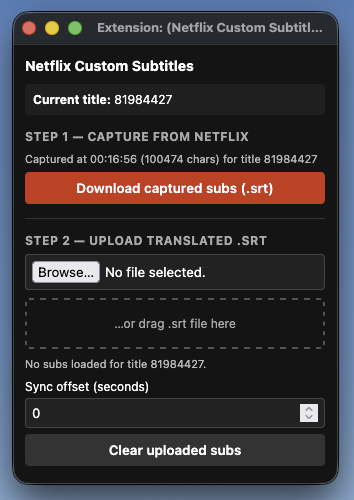

# net-trad

Firefox + Chrome extension to overlay custom subtitles on Netflix.

  

## Install

Grab latest from [Releases](https://github.com/lamphamTL/net-trad/releases/latest).

**Firefox** — download `netflix-subs-firefox-vX.Y.Z.xpi` → drag onto Firefox window → Add. Auto-updates from then on.

**Chrome / Edge / Brave** — download `netflix-subs-chrome-vX.Y.Z.zip` → unzip to a permanent folder → `chrome://extensions` → enable Developer mode → "Load unpacked" → pick folder. Manual update per release.

## How to use

1. **Open a Netflix title** — go to `netflix.com/watch/<id>` and start playback with the **original-language subtitles turned ON in the Netflix player**. The extension captures Netflix's own subtitle stream in the background; if subs are off, nothing gets captured.
2. **Open the extension popup**
3. **Download the `.srt`**
4. **Translate the .srt file** - Post the whole file to a AI platform (chatgpt, claude, perplexity etc...) and get it translated.
5. **Upload the translated `.srt`** — back in the popup, use **Browse…** or drag the file onto the drop zone. Subs apply immediately to the current title.
6. **Adjust sync if needed** — use **Sync offset (seconds)** to nudge timing (positive = subs appear later).

